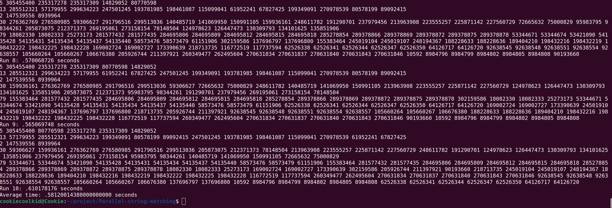
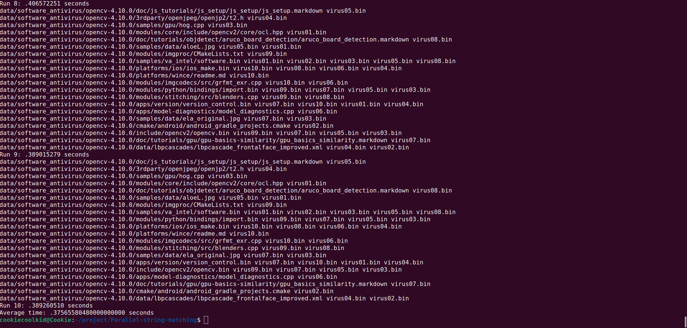

# Parallel-string-matching

## Document-Retrieval

场景一为文档检索，对应的代码文件为 `document_*.cpp` 为了能够更好的对比串匹配算法(串行/并行)的性能，实现了暴力算法、KMP 算法和 Trie 树算法的串匹配，并且对每种算法都实现了串匹配的并行版本。

由于这里以 `document_trie_parallel.cpp` 对应的并行算法处理文档检索的效率最高，所以接下来给出该程序的并行算法描述、伪代码、运行时间、技术要点（其余文档检索的程序将在性能测试中作为对比）

### 并行算法描述

该程序实现了一个并行的文档检索算法，使用了 Trie 树结构来存储模式，并行的策略为数据划分策略，将文档数据分块来进行并行，并利用 OpenMP 进行并行化处理。程序的主要步骤如下：

1. 读取文本文件和模式文件。
2. 将所有模式插入到 Trie 树中。
3. 使用 OpenMP 将文本分成多个块，并行地在每个块中搜索模式。
4. 计算每个块中的换行符总数，以便在最终结果中调整位置。
5. 合并所有线程的搜索结果，并输出匹配的位置。

### 伪代码运行流程

```plaintext
1. 读取文本文件和模式文件
2. 初始化 Trie 树
3. 将所有模式插入到 Trie 树中
4. 获取最大线程数和每个块的大小
5. 并行执行以下步骤：
    a. 在每个块中搜索模式
    b. 记录每个模式的匹配位置
6. 计算每个块中的换行符总数
7. 调整匹配位置以考虑换行符
8. 输出匹配结果
```

### 技术要点
1. Trie 树结构：用于高效地存储和搜索模式，使用 Trie 树的结构对于多个模式的搜索效率更高，此部分相当于可以并行处理多个 `pattern` 的串匹配。
2. OpenMP 并行化：采用并行计算中最普遍也最使用的划分技术来进行并行，将文本分成多个块，利用 OpenMP 库实现并行地在每个块中搜索模式串。
3. 读取文本采用二进制读取，可以提高读取速度。
4. 换行符处理：计算每个块中的换行符总数，以便在最终结果中调整位置。
5. 临界区：使用 OpenMP 的 #pragma omp critical 指令来合并线程的搜索结果，避免数据竞争。


### 运行时间
在本地测试环境下，各个程序的平均运行时间如下(共采样十轮取平均时间)：

| 程序名称 | 平均运行时间（s） |
| -------- | ------------------ |
| document_brute_force.cpp | 6.980766 |
| document_brute_force_parallel.cpp | 2.460773 |
| document_kmp.cpp | 6.684921 |
| document_kmp_parallel.cpp | 3.258452 |
| document_trie.cpp | 4.009726 |
| document_trie_parallel.cpp | 0.581200 |

下图为并行 Trie 树算法的运行测试结果：


- 这里可以看到串行情况下，Trie 树优于 KMP 算法 优于暴力算法，这是因为 Trie 树的数据结构特性使得其在多模式串匹配时具有更高的效率，而在并行情况下，Trie 树算法的性能进一步提升，为 Trie 树优于暴力算法 优于 KMP 算法，并且并行 Trie 树算法的性能相比串行版本有了显著提升，达到了大约 0.5s 的运行时间。并且有趣的是在简单采用划分计算来并行的 KMP 算法并没有比并行的暴力算法有更好的性能，这也许是因为 KMP 算法对于简单的划分并行并不能够很好的提升并行度，而 Trie 和暴力算法在采取划分策略的情况下可以更好的提升并行度。

## Software-antivirus

场景二为软件病毒查找，对应的代码文件为 `antivirus_*.cpp` 为了能够更好的对比串匹配算法(串行/并行)的性能，同样实现了暴力算法、KMP 算法和 Trie 树算法的串匹配，并且对每种算法都实现了串匹配的并行版本。

同样的，这里以 `antivirus_trie_parallel.cpp` 对应的并行算法处理软件病毒查找的效率最高，所以接下来给出该程序的并行算法描述、伪代码、运行时间、技术要点。

### 并行算法描述
该程序实现了一个并行的病毒检测算法，使用了 Trie 树结构来存储病毒模式，并利用 OpenMP 进行并行化处理。程序的主要步骤如下：

1. 读取包含文本文件和模式文件的目录。
2. 将所有模式文件的内容插入到 Trie 树中。
3. 使用 OpenMP 并行地处理每个文本文件，在每个文件中搜索模式。
4. 输出匹配的模式文件名。

### 伪代码运行流程

```plaintext
1. 读取包含文本文件和模式文件的目录
2. 初始化 Trie 树
3. 将所有模式文件的内容插入到 Trie 树中
4. 获取所有文本文件
5. 并行执行以下步骤：
    a. 读取文本文件内容
    b. 在文本文件中搜索模式
    c. 记录匹配的模式文件名
6. 输出匹配结果
```

### 技术要点
- Trie 树结构：用于高效地存储和搜索模式。
- OpenMP 并行化：并行地处理每个文本文件，提高处理速度。
- 文件系统遍历：使用 C++17 的 std::filesystem 库遍历目录，获取所有文本文件和模式文件。
- 临界区：使用 OpenMP 的 #pragma omp critical 指令来合并线程的输出，避免数据竞争。

### 运行时间
在本地测试环境下，各个程序的平均运行时间如下(共采样十轮取平均时间)：

| 程序名称 | 平均运行时间（s） |
| -------- | ------------------ |
| antivirus_brute_force.cpp | 3.780185 |
| antivirus_brute_force_parallel.cpp | 1.355863 |
| antivirus_kmp.cpp | 8.408125 |
| antivirus_kmp_parallel.cpp | 2.163169 |
| antivirus_trie.cpp | 1.075753 |
| antivirus_trie_parallel.cpp | 0.375656 |

下图为并行 Trie 树算法的运行测试结果：


- 这里可以看到串行的 `trie` 树结构来匹配字符串比并行的 `brute force` 和 `kmp` 算法性能还要更好，这很可能是因为结合当前场景——更多的病毒文件共同匹配，通过每一个病毒文件的大小也更大，此时采用 `trie` 结构更能够体现出其优势，而并行的 `trie` 树算法的性能相比串行版本又有了显著提升，达到了大约 0.37s 的运行时间，由于本身结构的并行度加上采用了划分计算的并行策略，利用 OpenMP 库实现并行地处理每个文本文件，提高处理速度，使得并行 `trie` 树算法的性能得到了进一步提升，个人认为效率已经较为理想。